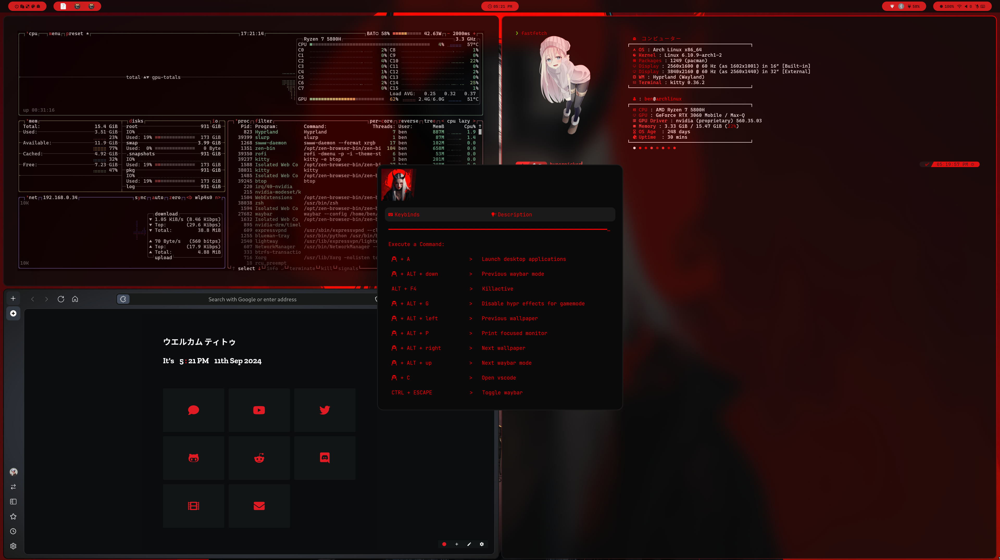
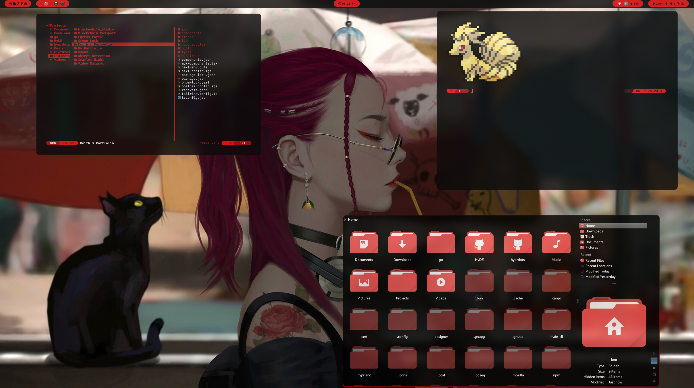

<div align = center><br><br></div>





> [!IMPORTANT]
> This is not a standalone theme, needs [Hyprdots](https://github.com/prasanthrangan/hyprdots) installed...

> [!NOTE]
> Work In Progress...

> [!CAUTION]
> Just put this here cause i wanted to make it purple blue red. colors of 3 haha.

## Installation

```sh
Hyde theme patch // and choose Scarlet Night
```

For More Themes, Check out the [HyDe Gallery](https://github.com/kRHYME7/hyde-gallery)